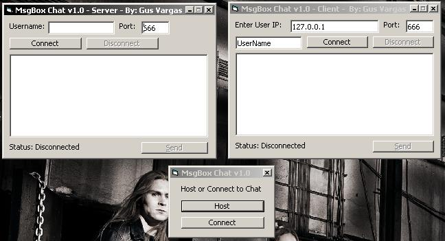



## MsgBox Chat

### Description

I decided to make a winsock app to help "newbies"(No offense to anyone) understand winsock and how it connects, send's data, recieves, etc. A chat program would be a perfect example, but there are so many chat examples out already. In this chat, all the messages are recieved in MsgBox's. It's a bit original, if this code doesn't help you fully understand how winsock works, it will help you to some extent if you have no idea what your doing.
 
### More Info
 

             |
---                |---
**Submitted On**   |2005-02-05 18:17:08
**By**             |[Gus Vargas](https://github.com/Planet-Source-Code/PSCIndex/blob/master/ByAuthor/gus-vargas.md)
**Level**          |Beginner
**User Rating**    |4.0 (8 globes from 2 users)
**Compatibility**  |VB 6\.0
**Category**       |[Complete Applications](https://github.com/Planet-Source-Code/PSCIndex/blob/master/ByCategory/complete-applications__1-27.md)
**World**          |[Visual Basic](https://github.com/Planet-Source-Code/PSCIndex/blob/master/ByWorld/visual-basic.md)
**Archive File**   |[MsgBox\_Cha184877252005\.zip](https://github.com/Planet-Source-Code/gus-vargas-msgbox-chat__1-58717/archive/master.zip)

